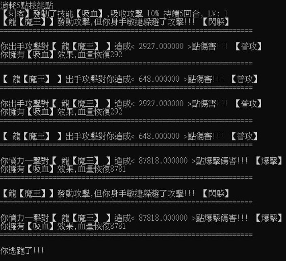



期末專題RPG

說明文件

作者 : C110152318\_ 徐士諭

1. 地圖功能 

首先是遊戲版面配置是分成 上面跟下面，上面都是腳色資訊， 下面則是遊戲時的訊息。 

地圖設計的部分，會在地圖 右上角顯示小地圖，小地圖會標 小地圖

記玩家當前位置，同時左上角也

會顯示你現在位置，可以使用上

下左右(方向鍵) w,a,s,d，也可以 使用move指令來進行移動。 

地圖背景故事 如果要打指令需要按下/才能

打指令(移動時不需要)。

商店功能 

遊戲設計可以在【超級商城】買東西， 在其他地方無法成功購買物品，同時超級商 城也是全地圖唯一沒有怪物的地方，而在超 級商城可以使用shop指令來購買東西，也可 以使用sell來賣東西，並且之後在背包檢視。

如果使用sell賣東西的話，價錢是根據Lv 和數量來決定的。

2. 怪物功能 

每次移動地圖或是擊殺一定數 量的怪物都會生成新的一批新的怪 物，玩家可以使用fight指令選擇跟 指定怪物對打，並且當擊殺一定數 量的怪物的時候，會繼續生成怪物， 每隻怪物都有各自機率生成，有些 怪物有可能傳說裝備。 

並且每次生成怪物都會顯示怪 物資訊，包括血量防禦攻擊等等。 

也可以使用ls的指令來顯示怪 物資訊。 

戰鬥資訊  

玩家可以使用【fight 怪物編號】來跟 指定怪物對打，在戰鬥時玩家可以選擇釋放 技能(按空白鍵，需消耗技能點)，也可以選 擇逃跑(ESC鍵)，會記錄下總共擊殺多少怪 物。 

3. 角色/物品 功能 

玩家可以在商店購買裝備或補 血、加防禦、攻擊等等的物品。 

有些傳說裝備能力較強，只能 在打特定怪物時才會掉落。 

玩家可以穿在三個部位的裝備 分別為【武器】、【胸甲】、【護 腿】，玩家可以先脫下在穿上，也 可以直接穿上(直接穿上會自動幫 玩家脫下原先部位的裝備。

所有指令為(bag use、bag deuse) 丟棄物品可以使用throw 

屬性能力值

玩家可以使用attribute來查看剩下多少 

【屬性點數】可以用來升級，並且可以查玩 家有加多少點數在各個屬性，後面是升級一 次加多少能力，可以一次加很多屬性能力。 

玩家升級會影響爆擊傷害，等級越高爆 擊傷害加成越高(也受到職業影響)。 

玩家爆擊率是則是需要套裝加成。 爆擊方面可以用showCRT查看。 

等級系統

玩家可以藉由打怪獲得經驗值，每隻怪 物的經驗都不相同，玩家最高可升級到100 等，每次升級會根據不同職業有不同傾向不 同能力加成方向，並且會獲得屬性點數、技 能點數、技能升級點數等等。

玩家可以在上半部分也就是資訊欄的部 份看到玩家的血量攻擊防禦等等，也可以看 到擊殺數、技能點、金錢等等，玩家也可以 使用showCRT來查看爆擊倍率和爆擊機率。

玩家除了

2022/12/19

人物狀態欄 

玩家除了可以在資訊處看到人物狀態外， 要升級技能或查看技能可以使用showSkill 或是skill。

裝備加成

玩家如果穿上三個部位的全套套裝就會 觸發套裝效果，當然如果脫下來就會消失。

遊戲中的套裝無法藉由商店獲得，只能 打特殊Bose才能獲得。

 原本 套裝效果

4. 點數系統功能 

在遊戲中有金錢系統，可以在商店 中購買各種商品，像是裝備、藥水、食 物等等，金錢可以在腳色資訊那邊看到。 

屬性點數可以在升級時候獲得，每 個等級只能獲得一點屬性點數，可以拿 來強化腳色但不會影響腳色升級的加強， 所以可以累積一次升級。 

技能升級點數可以用來升級技能， 玩家可輸入指令showSkill來查看技能等 級和剩餘點數。

5. 職業功能

遊戲中可選擇四個職業分別 是戰士、法師、刺客、坦克，各 自有各自的職業特性跟技能跟裝 備(商店有賣)，像是刺客有較高 的傷害等等。 

每個職業的技能都會在5級之 

後獲得。 

6. 技能功能  

遊戲可以使用showSkill來查 看玩家技能效果和技能有關的資訊， 玩家可以升級到5等就可以獲得技 能，之後每次升級都可以獲得【技 能升級點】，而【技能點】是在使 用技能時候會消耗，每次升級後技 能會得到加強，但是消耗也會變大。 

而技能最高可以升級到6等， 可以使用skill升級技能。 

7. 強化系統 

遊戲可以讓玩家使用屬性點數 來強化角色，玩家可以再生及時候 獲得。 

玩家亦可以升級裝備，使用或 升級裝備時如果沒有打上裝備等級， 就代表1等，如果打上等級則可選 擇該等級的裝備。 

加持道具 

玩家可以打怪來獲得金蘋果(不一定會 掉落)，使用後在過數秒後會消失，而補的 血量則是固定。

玩家亦可以在商店購買各類補品，有補 血家防禦、攻擊等等的道具。

VIII. 帳號功能 

玩家在登入時可以創建帳號登 入遊戲，最多可創建三個帳號，如 果已經滿了也可以選擇刪除帳號， 使用帳號登入可獲得與之前遊玩一 樣的狀態與裝備等等。 

如果玩家連續輸入三次錯誤密 碼會讓玩家重設密碼(需輸入兩次 相同才可以改成功)。 

玩家可以使用logout來登入不 同帳號或是切換職業。 

倉庫系統 

玩家將物品存入倉庫並在另外一個職業 拿出來，並且可以在從倉庫移除物品。

放入倉庫、取出、刪除和查看的指令分 別為store put、store get、store remove、 store show。

玩家不能將職業限定的裝備放入倉庫， 也不能將已經穿上的裝備放入昌庫。

IX. 設計其他功能 

玩家可以使用指令music play、 music stop 來播放或暫停背景音 樂。 

玩家可以直接將視窗關閉而不 會遺失資料。 

綁定icon到執行exe上面。 

以及要因應聖誕節的情景，遊 戲還添加了下雪的背景。 

